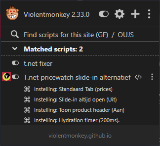

# tnet-pricewatch-slidein-alternatief

Laat de nieuwe pricewatch slide-in meer werken als gewone tabs

## Installeren

1. Zorg dat je GreaseMonkey, TamperMonkey of een andere variant hebt geinstalleerd.
2. [Klik hier](https://raw.githubusercontent.com/creesch/tnet-pricewatch-slidein-alternatief/main/tnet-pw-slidein-alternatief.user.js)

## Instellingen

- **Standaard tab**: Prices of specifications. Andere opties kan je proberen (reviews) maar die zijn lang niet altijd beschikbaar.
- **Slide-in altijd open**: Of de slide-in automatisch geopend moet worden wanneer je op een product pagina arriveert.
- **Toon product header**: Positioneert de slide-in over de product header.
- **Hydration timer**: Aangezien t.net gebruik maakt van moderene frameworks is het laden van de pagina geen indicatie dat alles aanwezig is. Zelfs als elementen aanwezig zijn kan het zijn dat er daana nog aanpassingen gedaan worden. Daarom wachten we soms gewoon even. Standaard staat deze waarde op 200ms, pas deze naar boven toe aan als het script niet betrouwbaar lijkt te werken. Naar beneden kan ook, op eigen risico ;)

## Screenshot

